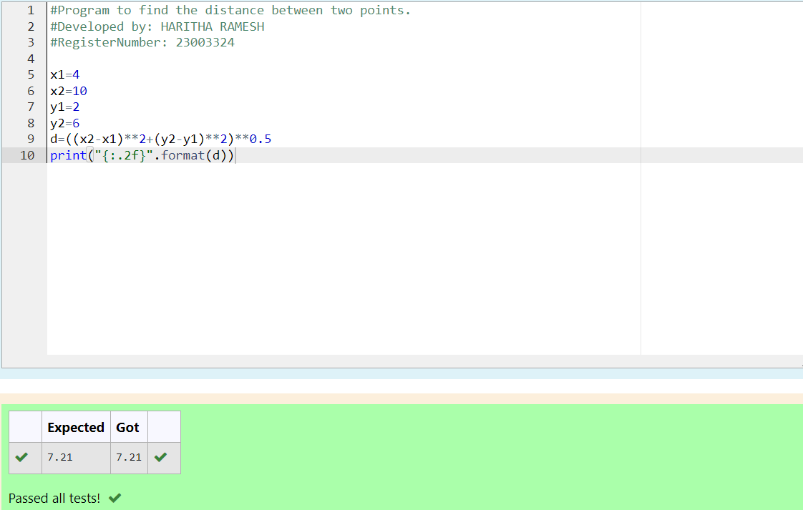

# DISTANCE-BETWEEN-TWO-POINTS

## AIM:
To write a python program to find the distance two 2 points.
## EQUIPMENTS REQUIRED:
1. Hardware – PCs
2. Anaconda – Python 3.7 Installation / Moodle-Code Runner
## ALGORITHM:
### Step 1: 
Assign the value for x1 and x2.
### Step 2: 
Assign the value for y1 and y2.
### Step 3: 
Substitute the values in the distance formula  
### Step 4: 
Print the value for distance between two points with two decimal places.
### Step 5: 
End the program.
### PROGRAM:
```#Program to find the distance between two points.
#Developed by: HARITHA RAMESH
#RegisterNumber: 23003324

x1=4
x2=10
y1=2
y2=6
d=((x2-x1)**2+(y2-y1)**2)**0.5
print("{:.2f}".format(d))
```
  
### OUTPUT:

### RESULT:
Thus the distance between two points are executed successfully.
